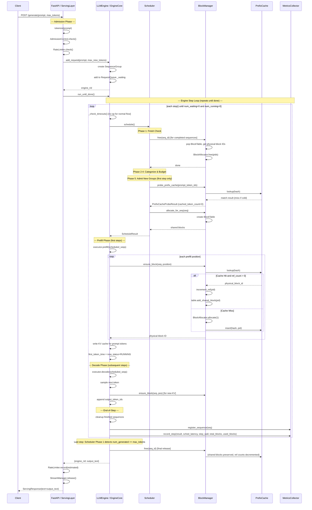
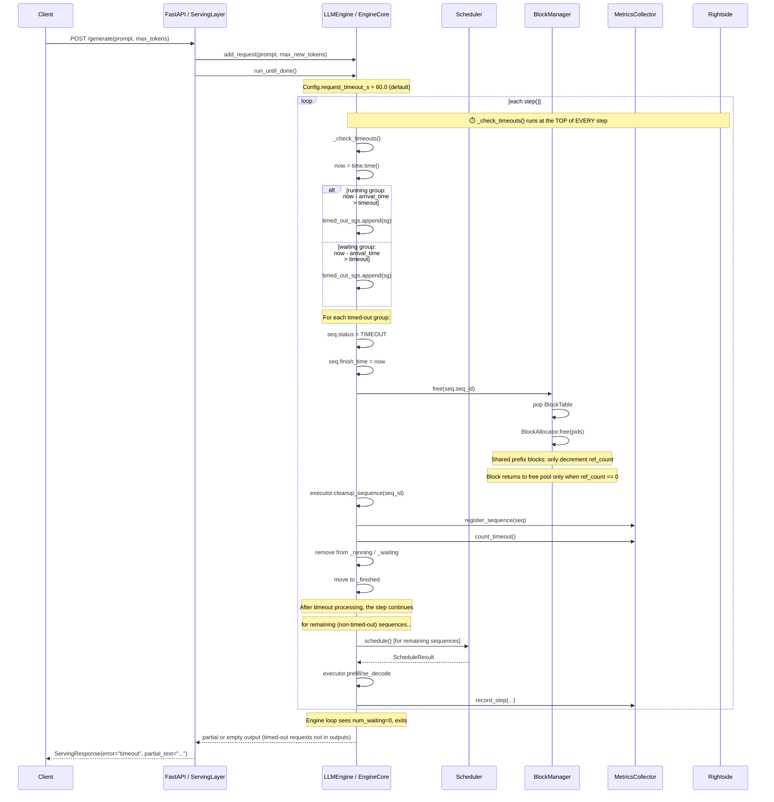
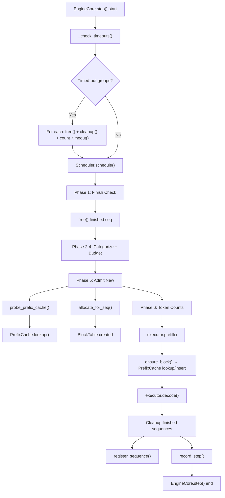

# mini-vLLM Serving Layer Sequence Diagrams

## Scenario 1: Normal Request Completion



---

## Scenario 2: Client Disconnect

```mermaid
sequenceDiagram
    participant Client
    participant FastAPI as FastAPI / ServingLayer
    participant CancelMgr as CancelManager
    participant Engine as LLMEngine / EngineCore
    participant BlockMgr as BlockManager
    participant Metrics as MetricsCollector

    Note over Client: Client closes connection mid-generation
    Client-->>FastAPI: TCP connection closed / HTTP disconnect

    Note over FastAPI: ⚠️ Limitation: No automatic disconnect detection
    Note over FastAPI: The synchronous engine loop cannot be interrupted.
    Note over FastAPI: The intended mechanism is explicit cancellation:

    FastAPI->>CancelMgr: cancel(request_id)

    CancelMgr->>Engine: cancel_request(request_id)

    Engine->>Engine: lookup SequenceGroup by request_id

    loop each unfinished sequence in group
        Engine->>Engine: seq.status = CANCELLED
        Engine->>Engine: seq.finish_time = now

        Engine->>BlockMgr: free(seq.seq_id)
        BlockMgr->>BlockMgr: pop BlockTable
        BlockMgr->>BlockMgr: get physical block IDs
        BlockMgr->>BlockMgr: BlockAllocator.free(pids)
        Note over BlockMgr: ref_count decremented; block returns to free pool only when ref_count == 0

        Engine->>Engine: executor.cleanup_sequence(seq_id)
        Engine->>Metrics: register_sequence(seq)
    end

    Engine->>Metrics: count_cancelled()

    Engine->>Engine: remove from _running / _waiting
    Engine->>Engine: move to _finished
    Engine-->>CancelMgr: done

    CancelMgr-->>FastAPI: success

    FastAPI-->>Client: (no response — connection already closed)
```

---

## Scenario 3: Request Timeout



---

## Component Reference: Step Lifecycle (All Three Flows Overlaid)



---

## Notes

1. **`BlockManager.free()` 是级联释放**：BlockManager 释放 BlockTable 时，会获得所有物理块 ID，逐一调用 `BlockAllocator.free(pid)`。后者的 `ref_count` 递减，只有当 `ref_count == 0` 时，物理块才真正归还空闲池。这使得通过 PrefixCache 共享的块在其中一个使用者释放后不会归还。

2. **`ensure_block()` 的双重 PrefixCache 检查**：Scheduler 的 `probe_prefix_cache()` 是只读探针（不改变引用计数），而 Executor 的 `ensure_block()` 在写入 KV 时会再次查询 PrefixCache。这是因为两次调用之间有间隔，另一个序列可能在中间注册了共享块。

3. **Timeout vs Cancel**：Timeout 在 EngineCore 内部自动触发（`_check_timeouts()` 在每个 step 顶部运行），而 Cancel 由 Serving 层通过 CancelManager 外部触发。但二者最终调用相同的释放路径（`free()` + `cleanup_sequence()` + `register_sequence()`），只是 metrics 计数器不同（`count_timeout()` vs `count_cancelled()`）。

4. **Client Disconnect 未自动检测**：当前架构是同步阻塞的，Engine 在 `run_until_done()` / `step()` 内部运行时无法被中断。用户需通过 `/cancel` 端点手动取消。
